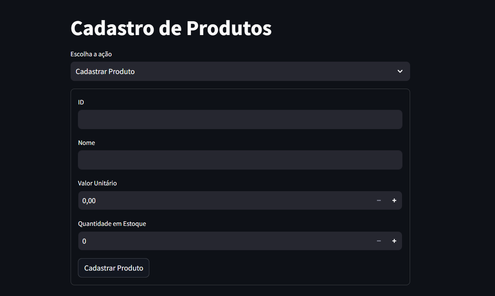
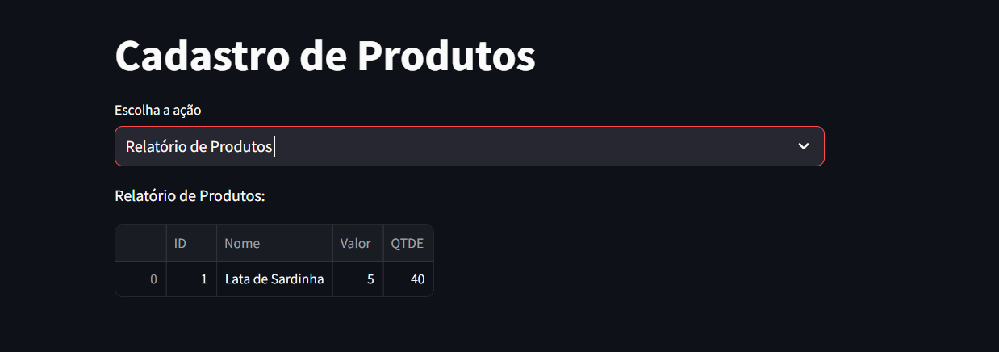
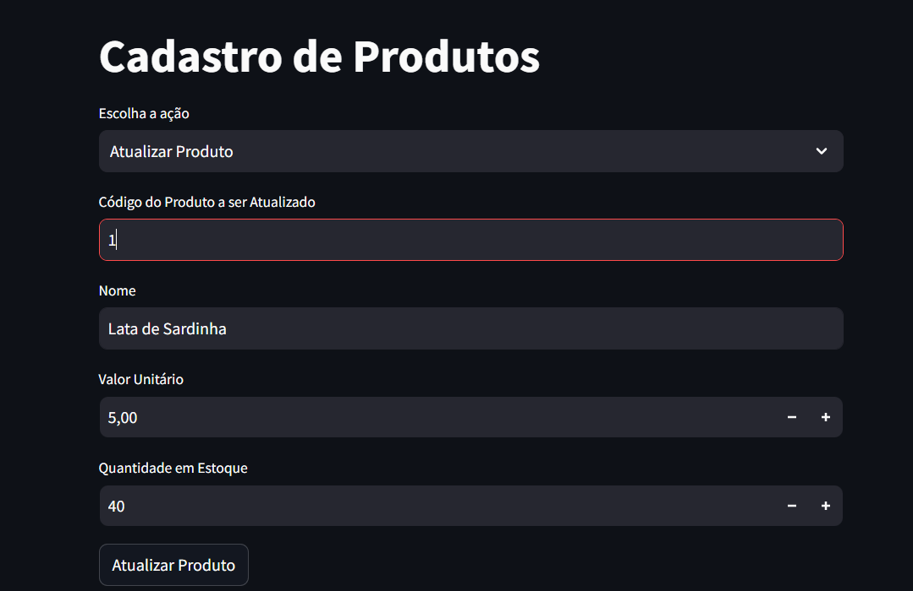
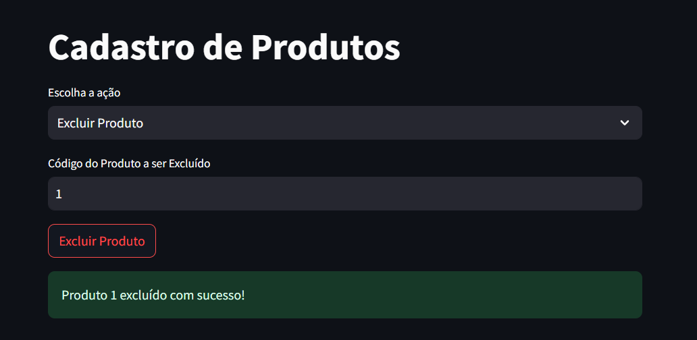

# Cadastro de Produtos com Streamlit e SQLite


Este é um projeto simples que utiliza Streamlit e SQLite para criar um sistema de cadastro e gerenciamento de produtos. Ele permite realizar operações como Cadastrar, Atualizar, Excluir e visualizar um Relatório de Produtos.


## Funcionalidades
- **Cadastro de Produto**: Permite inserir um novo produto no banco de dados.


- **Relatório de Produtos**: Exibe todos os produtos cadastrados.


- **Atualizar Produto**: Permite alterar informações de um produto existente.


- **Excluir Produto**: Permite remover um produto do banco de dados.



## Como Executar

1. **Instalar as dependências**:
   Para rodar este projeto, você precisa instalar o Streamlit e a biblioteca SQLite com o seguinte comando:
```bash
   pip install streamlit sqlite3
```

2. **Rodar a Aplicação**: E
    Execute o seguinte comando no terminal para iniciar o aplicativo Streamlit:

        streamlit run app.py

OBS: Crie um arquivo com qualquer nome utilizando python e inicialize o arquivo utilizando o comando acima para ver se está tudo certo com o streamlit !
